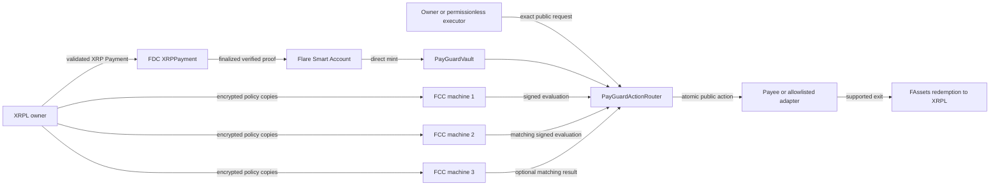

# XRP PayGuard

> Confidential payment-policy controls for XRP-native users, with public,
> independently verifiable execution on Flare.

[Live application](https://xrp-payguard.vercel.app/) ·
[Public evidence index](https://xrp-payguard.vercel.app/evidence/index.json) ·
[Hackathon handoff](docs/hackathon-handoff.md) ·
[Architecture](docs/technology/architecture.md) ·
[Threat model](docs/technology/threat-model.md) ·
[Verification matrix](docs/technology/verification.md)

XRP PayGuard lets an XRPL user fund a public Flare vault and commit to a
private, deterministic spending policy. The target authorization path freezes
three compatible Flare Confidential Compute (FCC) machines, requires all three
to acknowledge custody of the same policy commitment, and accepts an action
only after two distinct machines sign the same exact evaluation result.

PayGuard separates **control** from **custody**:

- the vault and resulting XRP/FTestXRP/FXRP movements remain public;
- the owner keeps policy limits, schedules, target rules, and internal
  operating constraints out of public calldata, events, storage, analytics,
  browser persistence, logs, and evidence; and
- no client, relay, executor, payee, owner, or administrator can directly
  supply an `ALLOW` decision.

PayGuard is not private money, a mixer, or a hidden-transfer system. Amount,
recipient, timing, asset, and transaction graph remain visible on their
respective public ledgers.

## Hackathon track

**Selected track: Interoperable Asset Products.** The owner confirmed this as
the primary track on 2026-08-09. This selection is not a claim that the project
has already been submitted, accepted, judged eligible, or awarded a bounty.

This is the strongest evidence-backed fit because the repository records a real
testnet XRP interoperability path:

1. a validated XRPL Testnet Payment;
2. an FDC `XRPPayment` request, finalized round, proof retrieval, and on-chain
   verification;
3. a Flare Smart Account direct mint into the PayGuard vault;
4. exact vault accounting and public conservation; and
5. separate public amount-based and destination-tag FAssets redemption
   observations.

The **Confidential Compute Apps** track is not selected for the current
submission boundary. PayGuard has a complete local three-machine
`SIMULATED_TEE` path, but no stable registered production FCC machines,
authenticated indexer, or live hardware-backed policy result. See
[`docs/competition.md`](docs/competition.md) for the evidence-based track
decision.

## The problem

XRPL users can transfer value efficiently, but programmable recurring payments
and treasury controls usually force one of three compromises:

- publish schedules, limits, counterparties, and internal rules in a smart
  contract;
- delegate keys and decision authority to a custodial automation provider; or
- keep every approval manual and lose reliable, auditable automation.

PayGuard keeps the rule private while making the resulting action and its
authorization evidence public. The first narrow product is confidential,
bounded recurring subscriptions and vendor allowances for XRP-native
individuals and treasury teams.

## Flagship journey



The current hackathon artifact proves different portions of this diagram at
different assurance levels:

- XRPL → FDC → Smart Account → vault funding is a real PayGuard-owned testnet
  observation.
- A second live XRPL/FDC proof was atomically consumed into one canonical
  `Pending` router request, with replay markers and request hash verified.
- The private policy, three-machine custody, threshold evaluation, recurring
  execution, denial, stop/resume/revoke, and conservation lifecycle passes
  locally and on Coston2 with ephemeral **simulated** signers. It is not a live
  FCC result.

## How PayGuard uses Flare

| Flare capability | PayGuard role | Current evidence boundary |
| --- | --- | --- |
| FAssets / FTestXRP / FXRP | Public XRP-backed vault asset and supported redemption exit | Live Coston2 funding and two public redemption observations; canonical default recovery remains open |
| FDC | Verify exact XRPL payments and selected external trigger facts | Live `XRPPayment` funding and one atomic `Pending` trigger pass; Web2Json remains local-only |
| Smart Accounts | Bind an XRPL user, PersonalAccount, nonce, fee, and exact `0xFE` operation | One direct-mint-to-vault transaction and a credential-free historical reconstruction pass |
| FTSOv2 | Supply a canonical, bounded, fresh reference value for policies denominated outside the native asset | Deterministic TypeScript/Go/Solidity logic and fail-closed adapters pass locally; no live FCC lifecycle using an FTSO snapshot is claimed |
| FCC | Store sealed policy copies and produce machine-signed deterministic evaluations | Typed extension, ciphertext-only ingress, sealed local store, reproducible image, and three-machine simulation pass; production machines/results are post-hackathon |

## Policy and authorization model

`POLICY_SCHEMA_V1` supports:

- fixed native-asset and FTSO-denominated public amount caps;
- UTC calendar-day and exact sliding rolling-window budgets;
- recurring slots, grace windows, occurrence limits, cooldown, start, and end;
- target allowlists and denylists;
- delegated requester/action classes;
- owner-only fallback when the delegate set is empty;
- canonical FDC source, destination, amount, memo/tag, freshness, proof, replay,
  and router-request bindings; and
- explicit deny precedence, emergency stop, expiry, cancellation, and safe
  recovery states.

Every evaluation binds the chain ID, registry, vault, router, policy ID,
policy commitment, machine/code policy, request hash, account, target, asset,
public amount, schedule slot, spend checkpoint/root, nonce, attempt, and expiry.
On-chain state is the canonical replay and rollback authority.

## Public and private data

| Data | Classification | Where it may exist |
| --- | --- | --- |
| Policy plaintext | Private | Owner memory and the intended confidential machine runtime only |
| Policy ciphertext | Private/opaque | Private ingress transport and sealed machine state only; never public evidence or chain state |
| XRPL/EVM/FCC private keys, seeds, credentials | Secret | Ignored local runtime configuration or external signer only |
| Policy commitment, machine/key/code fingerprints | Public | Registry, receipts, release/evidence records |
| Request hash, public amount, target, asset, nonce, timestamps | Public | Router, vault, transaction receipts, evidence |
| FDC/FTSO checkpoints and proof/result commitments | Public | Chain state and sanitized evidence |
| Token transfers and redemption | Public | XRPL and Flare ledgers |

## What is verified now

Snapshot: 2026-08-10. [`PLAN.md`](PLAN.md) records **105 of 128 gates
(82.0%)** complete. The remaining gates require owner/user activity, stable FCC
infrastructure, live protocol conditions, independent audits, or production /
mainnet work; they are not silently promoted by local tests.

| Area | Verified result | Important limitation |
| --- | --- | --- |
| Contracts | Non-upgradeable policy registry, vault, router, and atomic XRPL FDC consumer are deployed and runtime/constructor/wiring checked on Coston2 | This is not a complete release manifest or FCC authorization proof |
| XRP-native funding | Validated XRPL Payment → finalized FDC proof → on-chain `verifyXRPPayment` → Smart Account direct mint → `1,000,000` UBA vault deposit | The observed mint did not enter `DirectMintingDelayed` |
| Canonical FDC trigger | A separate 100-drop payment/proof was atomically replay-consumed into one router request with status `Pending` | No FCC evaluation, `ALLOW`, reserve, or execution followed |
| Private protocol | Cross-language policy codecs, schedule/spend math, FTSO/FDC composition, threshold domains, replay, and adversarial vectors pass | Registered hardware-backed machine custody/results are absent |
| Solution-3 lifecycle | Fourteen successful Coston2 transactions cover simulated three-machine registration, policy registration, recurring allow, cap denial, stop/resume/revoke, and exact vault conservation | Machine identities and result signers are explicitly ephemeral simulation |
| FAssets exit | Amount-based and `redeemWithTag` Coston2 requests have matching validated XRPL payouts and `RedemptionPerformed` observations | Partial/default recovery and canonical PayGuard settlement consumption remain open |
| Web2Json | Local source commitment allowlist, exact public request, jq/tuple ABI, MIC/response, source-asserted freshness, replay, and verifier failure tests pass | No production source, live proof, source-truth guarantee, private policy evaluation, or on-chain consumer |
| Web | Interactive Vercel Coston2 dApp, finalized wallet/vault/request reads, guarded writes, 3-actor simulated-FCC lifecycle, 16-asset evidence mirror, and production browser/Lighthouse pass | Production FCC/relay providers remain unavailable; the full hosted lifecycle is explicitly simulation-only |
| Release | Release validators fail closed | `pnpm release:check` correctly reports `planned`; no verified release manifest exists |

## Coston2 public identifiers

These are testnet observations, not mainnet or production custody addresses.
The evidence files remain authoritative for transaction hashes, blocks, runtime
hashes, wiring, and the exact source commit used for each deployment.

| Component | Public identifier |
| --- | --- |
| Network | Flare Coston2, chain ID `114` |
| `PayGuardPolicyRegistry` | [`0x8DFb2D7D7a2608Ee7Cd78983fbe28cCE00e1D4A4`](https://coston2-explorer.flare.network/address/0x8DFb2D7D7a2608Ee7Cd78983fbe28cCE00e1D4A4) |
| `PayGuardVault` | [`0xFFe7522075412B2eBA5b8B91c9aA4E1c2c6f84dB`](https://coston2-explorer.flare.network/address/0xFFe7522075412B2eBA5b8B91c9aA4E1c2c6f84dB) |
| `PayGuardActionRouter` | [`0x28A969018975Fb40aEd0BfA98f6d1c3023B6a7Da`](https://coston2-explorer.flare.network/address/0x28A969018975Fb40aEd0BfA98f6d1c3023B6a7Da) |
| `PayGuardXrplFdcTrigger` | [`0x4b626E2DA4D45034C8fAA38D10AbDfD4921486b2`](https://coston2-explorer.flare.network/address/0x4b626E2DA4D45034C8fAA38D10AbDfD4921486b2) |
| FCC foundation sender | [`0xA1e95721aD7F96D7f9bcd1d62b3A38A8625Cf8dC`](https://coston2-explorer.flare.network/address/0xA1e95721aD7F96D7f9bcd1d62b3A38A8625Cf8dC) |
| FCC foundation extension ID | `66037` — sender/extension binding only, not a production machine or live FCC result |
| Supported test asset | FTestXRP `0x0b6A3645c240605887a5532109323A3E12273dc7`, resolved and checked through supported Flare runtime sources |

The fully interactive hackathon demo is deliberately isolated from those
production-target contracts:

| Simulation-only component | Coston2 identifier |
| --- | --- |
| Demo registry | [`0xc5e18B97ca556B25e41FA0e0F3a6ba05B3Da2a49`](https://coston2-explorer.flare.network/address/0xc5e18B97ca556B25e41FA0e0F3a6ba05B3Da2a49) |
| Demo vault | [`0xF8e3A4516f63b09c2D3e02E5F1e7188308AA13F4`](https://coston2-explorer.flare.network/address/0xF8e3A4516f63b09c2D3e02E5F1e7188308AA13F4) |
| Demo router | [`0x01c91b3E11D85068A6898876e270bdFA2Fab0c09`](https://coston2-explorer.flare.network/address/0x01c91b3E11D85068A6898876e270bdFA2Fab0c09) |

### First-time interactive test

Use only a disposable testnet wallet and faucet assets. Never enter a real
operational policy or use mainnet value.

1. Open the live application and choose **Inspect Coston2 demo**.
2. Add/select Coston2 (chain ID `114`) in an injected EVM wallet. Obtain C2FLR
   for gas and FTestXRP from the official Flare faucet linked in Overview.
3. In **Demo lifecycle**, connect the wallet, leave the funding amount at `1`,
   press **Approve**, confirm finality, then press **Deposit**.
4. Open **Policy Studio** and press **Use isolated demo domain**. Review the
   generated test-only target, `0.1` FTestXRP per-action limit and `0.15`
   FTestXRP daily cap; then press **Validate & compute**.
5. Press **Collect 3 simulated receipts** and approve the three owner-signature
   prompts. No transaction is broadcast during custody. Then press
   **Register in demo contracts** and confirm the registry transaction.
6. Return to **Demo lifecycle**, create a `0.1` FTestXRP request, press
   **Evaluate with 3 actors**, submit two matching results, and execute the
   public transfer. Each confirmed write appears with a Coston2 explorer link.
7. Press **Prepare next request** and repeat with `0.1`. The actors must return
   `DENY · CAP_EXCEEDED`; submitting two matching denials must not move value.
8. Exercise **Stop**, **Resume**, and finally **Revoke**. Revocation is terminal.

The browser never sends an `ALLOW`/`DENY` choice to an actor; the deployed API
rejects a client-supplied decision. Refresh intentionally discards the private
draft, ciphertexts, and this-tab transaction log. Three actors share one Vercel
operator and are not hardware TEEs, so this flow demonstrates the complete
testnet product mechanics without satisfying production FCC custody gates.

## Live application and judge walkthrough

- Application: <https://xrp-payguard.vercel.app/>
- Evidence index: <https://xrp-payguard.vercel.app/evidence/index.json>
- Repository: <https://github.com/minhleeee123/xrp-payguard>

Suggested five-minute walkthrough:

1. Open the landing page and explain the boundary: private policy target,
   public transfer and settlement.
2. Press **Open app** with Enter and inspect the explicit provider-availability
   states. The shell never turns an unavailable dependency into mock success.
3. Follow **First-time test path** on Overview. The lifecycle and request read
   need no wallet; the official faucet link supplies C2FLR and FTestXRP for the
   optional injected-wallet path.
4. In **Vaults**, connect an injected Coston2 wallet, inspect finalized balances,
   then use the two-step FTestXRP transaction preview without exposing a key.
5. In **Requests**, load the prefilled canonical request; compare its router
   status, Payee projection, Auditor boundary, and guarded expiry action.
6. Open **Demo lifecycle** for either the wallet-free recorded lifecycle or the
   operational isolated testnet flow above. The latter has passed three actor
   receipts, policy registration, matching ALLOW execution, matching cap denial,
   conservation, and governance against the public Vercel origin. The false
   production assertions remain:
   `hardwareTeeVerified`, `stableHttpsOriginsVerified`,
   `authenticatedIndexerVerified`, and `registeredMachinesVerified` remain
   false. Policy Studio commitment generation remains local and is not a custody
   receipt or activation.

The deployed artifact is a public-safe static Vite bundle with an interactive
injected-wallet Coston2 client and evidence mirror. It contains no `.env.local`,
key, credential, private policy, ciphertext, or raw signature. No server-side
wallet, relay, or production FCC service is hidden behind the deployment.

## Evidence map

Public evidence is allowlisted, sanitized, and testnet-only. Start with
[`evidence/README.md`](evidence/README.md).

| Evidence | What it proves |
| --- | --- |
| [`contracts-deployment.json`](evidence/coston2/contracts-deployment.json) | Three core contracts, runtime/constructor checks, vault-router wiring, and supported FTestXRP |
| [`xrp-fdc-smart-account-funding-2026-08-09.json`](evidence/coston2/xrp-fdc-smart-account-funding-2026-08-09.json) | One PayGuard-owned XRP/FDC/Smart Account funding and vault-accounting path |
| [`coston2-funding-resume-audit-2026-08-09.json`](evidence/coston2/coston2-funding-resume-audit-2026-08-09.json) | Credential-free historical proof/calldata/runtime reconstruction |
| [`xrpl-fdc-trigger-deployment.json`](evidence/coston2/xrpl-fdc-trigger-deployment.json) | Atomic trigger consumer deployment, runtime, constructor, and proof-age boundary |
| [`xrpl-fdc-trigger-pending-2026-08-09.json`](evidence/coston2/xrpl-fdc-trigger-pending-2026-08-09.json) | Live validated payment/FDC proof, replay consumption, and canonical `Pending` request |
| [`fassets-redemption-2026-08-09.json`](evidence/coston2/fassets-redemption-2026-08-09.json) | Amount-based redemption request, XRPL payout, and matching settlement event |
| [`fassets-tagged-redemption-2026-08-09.json`](evidence/coston2/fassets-tagged-redemption-2026-08-09.json) | Tagged redemption and validated XRPL destination tag |
| [`fcc-local-three-machine-2026-08-09.json`](evidence/simulation/fcc-local-three-machine-2026-08-09.json) | Disposable local three-machine identity, ingress, hardening, restart, and cleanup smoke |
| [`coston2-simulated-policy-lifecycle-2026-08-09.json`](evidence/simulation/coston2-simulated-policy-lifecycle-2026-08-09.json) | Real Coston2 contract lifecycle with explicitly simulated policy signers |
| [`coston2-interactive-demo-deployment-2026-08-10.json`](evidence/simulation/coston2-interactive-demo-deployment-2026-08-10.json) | Separate demo contracts, three public actor descriptors, registrations, wiring, and mandatory false production assertions |
| [`vercel-interactive-demo-2026-08-10.json`](evidence/web/vercel-interactive-demo-2026-08-10.json) | Production-origin API, full automated Coston2 ALLOW/DENY/governance lifecycle, and laptop browser smoke |
| [`vercel-preview-2026-08-09.json`](evidence/web/vercel-preview-2026-08-09.json) | Current Vercel artifact, browser, keyboard, responsive, evidence, and Lighthouse audit |

Evidence may contain only public addresses, hashes, blocks, transaction IDs,
result commitments, timings, amounts already public by protocol design, and
assertion booleans. It must never contain private policy plaintext/ciphertext,
wallet or FCC keys, seeds, authenticated raw responses, credentials, or private
denial details.

## Quick start

### Prerequisites

The exact versions live in [`tooling/versions.json`](tooling/versions.json):

- Node `24.19.0`
- pnpm `10.33.0`
- Go `1.25.12`
- Foundry `1.7.1`
- Solidity `0.8.25`
- Docker only for the optional local FCC container smoke

The preflight rejects missing or drifting Node, pnpm, Go, and Forge versions.

### Install and run the web application

```sh
git clone git@github.com:minhleeee123/xrp-payguard.git
cd xrp-payguard
pnpm install --frozen-lockfile
pnpm toolchain:check
pnpm --filter @xrp-payguard/web dev
```

The Vite development URL is printed by the final command. The public shell and
read-only evidence views require no wallet key or API credential.

### Local configuration

Only create local configuration when running an applicable live-boundary tool:

```sh
cp .env.example .env.local
chmod 600 .env.local
```

`.env.local` is ignored. Keep every unset deployment field unset unless it has
been independently resolved and verified for PayGuard. Never copy an `.env`,
deployment manifest, extension ID, machine identity, signature, or evidence
from VeilBid or another project.

Transaction-writing tools require explicit capability flags such as
`--broadcast`; planning and verification commands remain read-only. Do not run
write commands with real assets or production credentials without an explicit,
reviewed runbook and authorization.

## Validation

Run the repository baseline:

```sh
pnpm check
pnpm -r typecheck
pnpm -r test
pnpm --filter @xrp-payguard/web build
(cd apps/fcc-extension && go test ./...)
forge test --root packages/contracts
```

The current validated baseline reports:

- 197 workspace tests: bindings 2, protocol 50, relay 13, demo protocol 7,
  integrations 83, demo API 4, web 34, and SDK examples 4; three explicitly
  gated web-live cases remain skipped in the ordinary unit run, while the full
  interactive Coston2 lifecycle gate passed separately;
- all workspace TypeScript typechecks and all Go packages passing;
- 43 Forge tests passing, including 256 fuzz runs and a 128-run / 8,192-call
  conservation invariant with zero reverts;
- a successful production web build;
- secret, privacy, public-evidence, deployment-audit, release, FCC tooling,
  Coston2 tooling, and generated-binding drift gates passing; and
- `pnpm release:check` returning `planned`, as expected while no verified
  PayGuard release manifest exists.

Optional credential-free FCC container smoke:

```sh
pnpm fcc:container:smoke
```

This creates disposable local simulation identities; it does not register a
production FCC machine.

## Repository layout

```text
apps/
  fcc-extension/       Go private-policy handler, ingress, sealed store, admission
  relay/               stateless threshold collection and executor orchestration
  web/                 landing, live vault/request views, demo, Auditor, evidence UI
packages/
  protocol/            canonical TypeScript types, codecs, math, fixtures, evaluator
  contracts/           Solidity registry, vault, router, FCC sender, FDC consumer
  integrations/        XRPL, FDC, FTSO, Smart Accounts, FAssets, Web2Json boundaries
  bindings/            deterministically generated PayGuard consumer bindings
  sdk-examples/         compile-tested wallet and Flare dApp integration previews
docs/                   product, architecture, security, verification, runbooks
evidence/
  coston2/              reviewed public-safe live testnet observations
  simulation/           reviewed records explicitly barred from live FCC claims
  web/                  repository-only deployment and corpus audits
tooling/                fail-closed deployment, recovery, evidence, and drift gates
```

## Security invariants

Contributors must read [`AGENTS.md`](AGENTS.md) before changing code. Core
non-negotiable rules include:

- policy plaintext and ciphertext never enter public chain data, analytics,
  browser persistence, public evidence, or logs;
- private ingress returns registered machine-signed custody receipts before a
  policy commitment can become canonical;
- every canonical policy freezes three compatible machine identities and key
  fingerprints; the target is all-three custody and two matching evaluations;
- every evaluation is bound to the full policy/request/chain/contract/state/
  nonce/time/code domain;
- FDC, FTSO, FAssets, Smart Accounts, RPC, FCC, relay, or indexer failure fails
  closed—no mock approval, proof, price, payment, or execution becomes success;
- no AI or natural-language model decides canonical authorization;
- runtime addresses are resolved through supported Flare sources and verified,
  not copied from another environment; and
- XRPL seeds, EVM/FCC private keys, proxy credentials, signatures, and private
  policies never enter source control or evidence.

The full attacker model, residual trust, and non-claims are documented in
[`docs/technology/threat-model.md`](docs/technology/threat-model.md).

## Current limitations and roadmap

The hackathon deliberately uses **solution 3**: real public Coston2/XRPL facts,
a deployed static product/evidence shell, and explicit local/simulated FCC
authorization. The following remain post-hackathon or owner/external gates:

- three stable HTTPS FCC machine origins and authenticated indexer access;
- registered production machines, all-three live custody receipts, two matching
  live evaluation results, and supported replacement recovery;
- hosted relay/proxy and full dependency-outage drills;
- a real `DirectMintingDelayed` resume and canonical partial/default FAssets
  recovery;
- a verified PayGuard release manifest and exact consumer bindings;
- owner-session DoraHacks eligibility/form submission and public video URL;
- interviews, usability sessions, testnet design-partner pilots, and measured
  feedback;
- independent contract/TEE security review and remediation; and
- fresh mainnet resolution, canary, managed monitoring, bounded-value pilot,
  incident coverage, and explicit real-asset authorization.

No real-asset or mainnet transaction is authorized by this repository or by the
current hackathon scope.

## Documentation

1. [`AGENTS.md`](AGENTS.md) — mandatory engineering, privacy, and evidence rules.
2. [`PLAN.md`](PLAN.md) — phase gates and current progress.
3. [`DESIGN.md`](DESIGN.md) — canonical visual and interaction system.
4. [`docs/README.md`](docs/README.md) — complete documentation index.
5. [`docs/product/product-plan.md`](docs/product/product-plan.md) — product,
   users, editions, capabilities, and acceptance criteria.
6. [`docs/product/user-journeys.md`](docs/product/user-journeys.md) — owner,
   treasury, payee, executor, and auditor journeys.
7. [`docs/technology/architecture.md`](docs/technology/architecture.md) —
   component, data-flow, trust, and recovery model.
8. [`docs/technology/contract-spec.md`](docs/technology/contract-spec.md) —
   V1 schemas, domains, state transitions, and contract rules.
9. [`docs/technology/verification.md`](docs/technology/verification.md) — test
   matrix, evidence gates, and release acceptance.
10. [`docs/hackathon-handoff.md`](docs/hackathon-handoff.md) — reproducible demo,
    validation facts, limitations, and pushed history.
11. [`docs/submission-draft.md`](docs/submission-draft.md) — copy-ready
    Interoperable Asset Products submission material.
12. [`docs/new-work-ledger.md`](docs/new-work-ledger.md) — retrospective
    classification of new, adapted, third-party, and reference-only work.

VeilBid is read-only reference material. No VeilBid secret, deployment,
evidence, signature, extension ID, machine identity, or unverified product claim
is a PayGuard fact.
