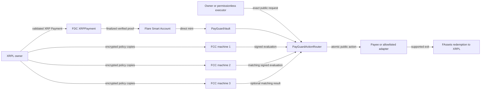

# XRP PayGuard

> Confidential payment-policy controls for XRP-native users, with public,
> independently verifiable execution on Flare.

[Live application](https://xrp-payguard.vercel.app/) ·
[Five-minute judge walkthrough](#live-application-and-judge-walkthrough) ·
[Public evidence index](https://xrp-payguard.vercel.app/evidence/index.json) ·
[Hackathon handoff](docs/hackathon-handoff.md) ·
[Architecture](docs/technology/architecture.md) ·
[Threat model](docs/technology/threat-model.md) ·
[Verification matrix](docs/technology/verification.md)

XRP PayGuard lets an XRPL user fund a public Flare vault and commit to a
private, deterministic spending policy. The target authorization path freezes
three compatible Flare Confidential Compute (FCC) machines, requires all three
to acknowledge custody of the same policy commitment, and accepts an action
only after two distinct machines sign the same exact evaluation result.

PayGuard separates **control** from **custody**:

- the vault and resulting XRP/FTestXRP/FXRP movements remain public;
- the owner keeps policy limits, schedules, target rules, and internal
  operating constraints out of public calldata, events, storage, analytics,
  browser persistence, logs, and evidence; and
- no client, relay, executor, payee, owner, or administrator can directly
  supply an `ALLOW` decision.

PayGuard is not private money, a mixer, or a hidden-transfer system. Amount,
recipient, timing, asset, and transaction graph remain visible on their
respective public ledgers.

## Judge highlights

- **Real XRP interoperability:** a validated XRPL Testnet payment was proven
  through FDC, minted through a Flare Smart Account, and accounted for in the
  PayGuard vault; public FAssets redemption observations complete the XRP path.
- **Private rules, public authorization:** three registered Coston2 FCC
  machines hold the policy copies and two matching machine-signed evaluations
  authorize the exact public action. The current machines are explicitly
  `SIMULATED_TEE`, not hardware-attested production infrastructure.
- **Immediately inspectable:** use the
  [live application](https://xrp-payguard.vercel.app/), follow the
  [five-minute walkthrough](#live-application-and-judge-walkthrough), or audit
  the [public evidence index](https://xrp-payguard.vercel.app/evidence/index.json)
  without a wallet.

## Quick start

### Run the web application

The web application requires Node `24.19.0` and pnpm `10.33.0`.

```sh
git clone https://github.com/minhleeee123/xrp-payguard.git
cd xrp-payguard
pnpm install --frozen-lockfile
pnpm --filter @xrp-payguard/web dev
```

The Vite development URL is printed by the final command. The public shell and
read-only evidence views require no wallet key or API credential.

### Full repository toolchain

Full validation additionally requires Go `1.25.12`, Foundry `1.7.1`, and
Solidity `0.8.25`; Docker is needed only for the optional local FCC container
smoke. All exact versions live in
[`tooling/versions.json`](tooling/versions.json). Run `pnpm toolchain:check`
before the validation commands below; the preflight fails on missing or
drifting Node, pnpm, Go, or Forge versions.

### Local configuration

Only create local configuration when running an applicable live-boundary tool:

```sh
cp .env.example .env.local
chmod 600 .env.local
```

`.env.local` is ignored. Keep every unset deployment field unset unless it has
been independently resolved and verified for PayGuard. Never copy an `.env`,
deployment manifest, extension ID, machine identity, signature, or evidence
from VeilBid or another project.

Transaction-writing tools require explicit capability flags such as
`--broadcast`; planning and verification commands remain read-only. Do not run
write commands with real assets or production credentials without an explicit,
reviewed runbook and authorization.

## Hackathon track

**Selected track: Interoperable Asset Products.** The owner confirmed this as
the primary track on 2026-08-09. This selection is not a claim that the project
has already been submitted, accepted, judged eligible, or awarded a bounty.

This is the strongest evidence-backed fit because the repository records a real
testnet XRP interoperability path:

1. a validated XRPL Testnet Payment;
2. an FDC `XRPPayment` request, finalized round, proof retrieval, and on-chain
   verification;
3. a Flare Smart Account direct mint into the PayGuard vault;
4. exact vault accounting and public conservation; and
5. separate public amount-based and destination-tag FAssets redemption
   observations.

The **Confidential Compute Apps** track is not selected for the current
submission boundary. PayGuard now has three stable, registered Coston2
`SIMULATED_TEE` machines, authenticated indexer connectivity, all-three live
private-policy custody, and a verified two-of-three evaluation/execute/deny
lifecycle. This organizer-approved simulated setup is suitable for Coston2
hackathon judging. The live web/relay path now uses the manager-backed V2
Coston2 simulated profile, but this is not hardware attestation or a verified
release. See
[`docs/competition.md`](docs/competition.md) for the evidence-based track
decision.

## The problem

XRPL users can transfer value efficiently, but programmable recurring payments
and treasury controls usually force one of three compromises:

- publish schedules, limits, counterparties, and internal rules in a smart
  contract;
- delegate keys and decision authority to a custodial automation provider; or
- keep every approval manual and lose reliable, auditable automation.

PayGuard keeps the rule private while making the resulting action and its
authorization evidence public. The first narrow product is confidential,
bounded recurring subscriptions and vendor allowances for XRP-native
individuals and treasury teams.

## Flagship journey

The end-to-end product flow is:

1. The owner creates a spending policy locally and sends encrypted copies to
   three registered FCC machines; policy plaintext never enters public chain
   data or evidence.
2. All three machines return signed custody receipts for the same policy
   commitment, allowing the owner to register and freeze that exact machine
   set on Coston2.
3. The owner funds the policy vault through the XRP-native path: an XRPL
   payment is verified by FDC and minted through a Flare Smart Account, or the
   owner deposits supported FTestXRP directly.
4. An authorized requester creates an exact public payment request containing
   the target, asset, amount, nonce, schedule slot, and expiry—but not the
   private policy.
5. The FCC machines independently evaluate the stored policy. Two matching,
   request-bound signed results are required; no browser, relay, owner, or
   administrator can supply `ALLOW` directly.
6. The router verifies the threshold and current on-chain state, then executes
   the public payment atomically or fails closed. Supported FAssets redemption
   can return value to XRPL through a separately public settlement path.

The same flow and its trust boundaries are shown below:



The current hackathon artifact proves different portions of this diagram at
different assurance levels:

- XRPL → FDC → Smart Account → vault funding is a real PayGuard-owned testnet
  observation.
- A second live XRPL/FDC proof was atomically consumed into one canonical
  `Pending` router request, with replay markers and request hash verified.
- The private policy, three-machine custody, threshold evaluation, execution,
  cap denial, stop/resume/revoke, and conservation lifecycle passes locally and
  in a separate live Coston2 run using three stable Railway FCC machines.
- Those machines are registered to extension `66037`, report manager status
  `2 = PRODUCTION`, and completed real dispatch/delivery plus verified TEE,
  proxy, custody, and evaluation signatures. The runtime remains explicitly
  `SIMULATED_TEE`; status `2` is not represented as hardware attestation.

## How PayGuard uses Flare

| Flare capability | PayGuard role | Current evidence boundary |
| --- | --- | --- |
| FAssets / FTestXRP / FXRP | Public XRP-backed vault asset and supported redemption exit | Live Coston2 funding and two public redemption observations; canonical default recovery remains open |
| FDC | Verify exact XRPL payments and selected external trigger facts | Live `XRPPayment` funding and one atomic `Pending` trigger pass; Web2Json remains local-only |
| Smart Accounts | Bind an XRPL user, PersonalAccount, nonce, fee, and exact `0xFE` operation | One direct-mint-to-vault transaction and a credential-free historical reconstruction pass |
| FTSOv2 | Supply a canonical, bounded, fresh reference value for policies denominated outside the native asset | Deterministic TypeScript/Go/Solidity logic and fail-closed adapters pass locally; no live FCC lifecycle using an FTSO snapshot is claimed |
| FCC | Store sealed policy copies and produce machine-signed deterministic evaluations | Typed extension, ciphertext-only atomic store, reproducible Railway image, authenticated Coston2 indexer, three stable registered simulated machines, signed PING, all-three live V2 custody, live two-of-three ALLOW/execute/CAP-denial, and V1 C→D replacement recovery; hardware attestation, the remaining V2 outage matrix, and verified release remain open |

## Policy and authorization model

`POLICY_SCHEMA_V1` supports:

- fixed native-asset and FTSO-denominated public amount caps;
- UTC calendar-day and exact sliding rolling-window budgets;
- recurring slots, grace windows, occurrence limits, cooldown, start, and end;
- target allowlists and denylists;
- delegated requester/action classes;
- owner-only fallback when the delegate set is empty;
- canonical FDC source, destination, amount, memo/tag, freshness, proof, replay,
  and router-request bindings; and
- explicit deny precedence, emergency stop, expiry, cancellation, and safe
  recovery states.

Every evaluation binds the chain ID, registry, vault, router, policy ID,
policy commitment, machine/code policy, request hash, account, target, asset,
public amount, schedule slot, spend checkpoint/root, nonce, attempt, and expiry.
On-chain state is the canonical replay and rollback authority.

## Public and private data

| Data | Classification | Where it may exist |
| --- | --- | --- |
| Policy plaintext | Private | Owner memory and the intended confidential machine runtime only |
| Policy ciphertext | Private/opaque | Private ingress transport and sealed machine state only; never public evidence or chain state |
| XRPL/EVM/FCC private keys, seeds, credentials | Secret | Ignored local runtime configuration or external signer only |
| Policy commitment, machine/key/code fingerprints | Public | Registry, receipts, release/evidence records |
| Request hash, public amount, target, asset, nonce, timestamps | Public | Router, vault, transaction receipts, evidence |
| FDC/FTSO checkpoints and proof/result commitments | Public | Chain state and sanitized evidence |
| Token transfers and redemption | Public | XRPL and Flare ledgers |

## What is verified now

Snapshot: 2026-08-13. [`PLAN.md`](PLAN.md) records **104 of 105 pre-hackathon
gates (99.0%)** complete. The owner confirmed hands-on testing of every
implemented submission-boundary surface and flow, and all passed to the
owner's satisfaction. The only open pre-submission gate is the owner-only final
form/account/bounty/video-upload/submission action; the final local video has
already been reviewed and accepted by the owner. Structured external cohort
validation remains a disclosed post-hackathon target and is not inferred from
owner acceptance. The live production-monitoring gate was deliberately
pulled forward and added to both numerator and denominator; all remaining
explicit post-hackathon gates stay outside this headline count.

| Area | Verified result | Important limitation |
| --- | --- | --- |
| Contracts | A parallel V2 registry/vault/router namespace is deployed and runtime/constructor/wiring checked on Coston2; V2 immutably binds the official manager, extension `66037`, code hash, and chain-114-only simulated profile | This is a live simulated candidate, not the hardware-attested verified release manifest; V1 remains available only as a rollback namespace |
| XRP-native funding | Validated XRPL Payment → finalized FDC proof → on-chain `verifyXRPPayment` → Smart Account direct mint → `1,000,000` UBA vault deposit | The observed mint did not enter `DirectMintingDelayed` |
| Canonical FDC trigger | A separate 100-drop payment/proof was atomically replay-consumed into one router request with status `Pending` | No FCC evaluation, `ALLOW`, reserve, or execution followed |
| Private protocol | Cross-language policy codecs, schedule/spend math, FTSO/FDC composition, threshold domains, replay, atomic ciphertext persistence, adversarial vectors, stable FCC origins, authenticated indexer access, registration, signed PING, all-three custody, two-of-three live evaluation, and replacement recovery pass | The live machines use organizer-supported simulated attestation; hardware-backed custody and the full dependency-outage matrix remain absent |
| Live FCC lifecycle | Three registered Railway machines encrypted/stored one policy independently, returned three verified receipts/evaluations, and drove V2 through ALLOW→execute, `CAP_EXCEEDED` DENY, owner-only stop/resume/revoke, and exact vault conservation; the earlier V1 run also records executor-pause and replacement recovery | `SIMULATED_TEE=true`; the complete V2 outage matrix and hardware release manifest remain open |
| Solution-3 demo lifecycle | Fourteen successful Coston2 transactions cover simulated three-machine registration, policy registration, recurring allow, cap denial, stop/resume/revoke, and exact vault conservation | The older demo identities and result signers are explicitly ephemeral simulation and separate from the live Railway run |
| FAssets exit | Amount-based and `redeemWithTag` Coston2 requests have matching validated XRPL payouts and `RedemptionPerformed` observations | Partial/default recovery and canonical PayGuard settlement consumption remain open |
| Web2Json | Local source commitment allowlist, exact public request, jq/tuple ABI, MIC/response, source-asserted freshness, replay, and verifier failure tests pass | No production source, live proof, source-truth guarantee, private policy evaluation, or on-chain consumer |
| Web + hosted relay | The production Vercel dApp and Railway relay use the V2 namespace for authenticated ciphertext-only ingress, three custody receipts, request-ID-only two-of-three evaluation, execution, cap denial, and owner lifecycle. Its 26-asset evidence mirror includes aggregate production-monitor, stale-machine pause, and independent-owner lifecycle evidence; explicit V1 addresses remain rollback metadata | This is the Coston2 `SIMULATED_TEE=true` V2 candidate, not a hardware-backed verified release or mainnet production |
| Production monitoring | An independent Railway service probes the relay, Coston2 RPC, and A/B/D, retains bounded aggregate samples/incidents, exposes only origin-bound aggregate health publicly, and protects status/metrics/incidents with a managed bearer | This is availability monitoring for the simulated testnet candidate, not an SLA, security audit, hardware proof, or release promotion |
| Release | Release and V2 candidate validators fail closed | `pnpm release:check` remains `planned`; the live candidate stays `verified: false` until the post-hackathon outage, canonical redemption, independent pilot-validation, and hardware-release gates pass; these are not submission blockers |

## Coston2 public identifiers

These are testnet observations, not mainnet or production custody addresses.
The evidence files remain authoritative for transaction hashes, blocks, runtime
hashes, wiring, and the exact source commit used for each deployment.

| Component | Public identifier |
| --- | --- |
| Network | Flare Coston2, chain ID `114` |
| `PayGuardPolicyRegistryV2` | [`0xbB89d68Efd3994CD688816c175343511bA5c0E88`](https://coston2-explorer.flare.network/address/0xbB89d68Efd3994CD688816c175343511bA5c0E88) |
| V2 `PayGuardVault` | [`0xe8f5b30F9adCea6b8532bFbD65f804E771520214`](https://coston2-explorer.flare.network/address/0xe8f5b30F9adCea6b8532bFbD65f804E771520214) |
| V2 `PayGuardActionRouter` | [`0x452988f04bE9602EC0CEB0239EBA5Fe60d8988D3`](https://coston2-explorer.flare.network/address/0x452988f04bE9602EC0CEB0239EBA5Fe60d8988D3) |
| `PayGuardXrplFdcTrigger` | [`0x4b626E2DA4D45034C8fAA38D10AbDfD4921486b2`](https://coston2-explorer.flare.network/address/0x4b626E2DA4D45034C8fAA38D10AbDfD4921486b2) |
| `FlareTeeManager` | [`0x1a9C4A0f9D76c0b1D91d22E24E573a9b377618aE`](https://coston2-explorer.flare.network/address/0x1a9C4A0f9D76c0b1D91d22E24E573a9b377618aE) |
| FCC extension and machines | Extension `66037`; active registered simulated machines A/B/D are indexed by the [Coston2 Systems Explorer](https://coston2-systems-explorer.flare.network/tee/objects) |
| Hosted FCC relay | <https://payguard-live-relay-production.up.railway.app> · `COSTON2_SIMULATED_V2` · authenticated owner ingress and exact-requester evaluation · V1 Railway rollback retained |
| Supported test asset | FTestXRP `0x0b6A3645c240605887a5532109323A3E12273dc7`, resolved and checked through supported Flare runtime sources |

Exact machine identities, dispatch/freeze/ALLOW/DENY transactions, rollback
addresses, and the deliberately isolated demo contracts remain in the
[reviewed evidence index](evidence/README.md). They are omitted here to keep
the reviewer path focused.

### Current judge and self-service test paths

The judge-safe path needs no wallet: open **Demo lifecycle** and inspect the
primary V2 proof with three status-2 machines, ALLOW execution, `CAP_EXCEEDED`
denial, conservation, and thirteen linked Coston2 checkpoints. The live
relay/machine readiness card remains visible beside it. Never enter a real
operational policy or use mainnet value.

The self-service write path accepts any injected wallet connected to chain ID
`114`. Wallet A becomes the owner of its newly computed policy, privately
designates requester/payee B, authorizes all three custody copies, verifies
three live FCC receipts, registers the policy, and funds its vault. A then
shares only the public policy commitment. B loads that commitment, creates its
own request, signs the request-specific FCC evaluation authorization, and may
execute an `ALLOWED` payment without a new signature from A. The relay request
contains `{}` and an exact requester authorization, never a browser-supplied
decision. The relay remains a bounded gas-paying dispatcher and gains no policy
ownership or governance right.
Refresh discards the policy, ciphertexts, authorizations, signatures, and
this-tab transaction log.

A two-wallet Coston2 run verified that separation on 2026-08-12: independent A
registered/funded/governed its V2 policy and independent B created, authorized,
executed, and received `0.1 FTestXRP` without an A request signature.
`REQUESTER_DENIED`, `TARGET_DENIED`, `CAP_EXCEEDED`, owner-as-requester,
wrong-signer, requester governance, stopped-policy, and revoked-policy cases
failed closed. All remaining test funds were returned. This remains a simulated
testnet candidate, not a hardware or release claim.

The deployment verification uses dedicated ephemeral owner and requester
wallets. It writes their temporary keys only to ignored mode-`0600`
`.local/multi-owner-live/.env.local`, funds both with Coston2 gas and the owner
with FTestXRP, exercises owner custody/registration/funding/governance plus
requester creation/evaluation/execution and requester/target/cap denial
negatives, returns all remaining test funds, removes the recovery file, and
records public-safe evidence only. Preview the exact writes
with `pnpm fcc:multi-owner:plan`; the broadcast command remains explicitly
acknowledged and testnet-only.

## Live application and judge walkthrough

- Application: <https://xrp-payguard.vercel.app/>
- Evidence index: <https://xrp-payguard.vercel.app/evidence/index.json>
- Repository: <https://github.com/minhleeee123/xrp-payguard>

Suggested five-minute walkthrough:

1. Open the landing page and explain the boundary: private policy target,
   public transfer and settlement.
2. Press **Open app** with Enter and inspect the explicit provider-availability
   states. The shell never turns an unavailable dependency into mock success.
3. Open **Policy Studio**. The lifecycle and public request reads need no
   wallet; the official faucet link supplies C2FLR and FTestXRP for an optional
   self-service injected-wallet path.
4. In **Vaults**, connect an injected Coston2 wallet, inspect finalized balances,
   then enter one human-readable FTestXRP deposit amount. The app requests an
   exact approval only when the finalized allowance is insufficient and never
   exposes a key.
5. In **Requests**, create a payment from an active public policy commitment.
   Then open **Payment details**, load one of the four prior test IDs, and compare
   its canonical outcome, payee facts, FCC boundary, and guarded public action.
6. Open **Demo lifecycle** and inspect the primary wallet-free V2 proof and its
   thirteen explorer-linked checkpoints, then the hosted readiness card for the
   Railway relay and registered A/B/D machines. Any funded Coston2 wallet may
   create, register, fund, request against, and govern its own policy. The
   historical isolated V1 actor run remains collapsed, separately labelled,
   and is never reassigned to the active V2 artifact.

The deployed artifact is a public-safe static Vite bundle with an interactive
injected-wallet Coston2 client, evidence mirror, and an explicit HTTPS connection
to the Railway relay. It contains no `.env.local`, key, credential, private
policy, ciphertext, or raw signature. Relay signing and FCC/indexer credentials
remain server-side; the UI labels this as the simulated V2 candidate path rather
than a verified release.

## Evidence map

Public evidence is allowlisted, sanitized, and testnet-only. Start with
[`evidence/README.md`](evidence/README.md).

| Evidence | What it proves |
| --- | --- |
| [Core contracts](evidence/coston2/contracts-v2-simulated.json) | V2 runtime, constructors, official manager, simulated machine profile, and vault-router wiring |
| [XRPL/FDC/Smart Account funding](evidence/coston2/xrp-fdc-smart-account-funding-2026-08-09.json) and [canonical trigger](evidence/coston2/xrpl-fdc-trigger-pending-2026-08-09.json) | Validated XRP payment, finalized FDC proof, direct mint, exact vault accounting, replay consumption, and one canonical `Pending` request |
| [Amount redemption](evidence/coston2/fassets-redemption-2026-08-09.json) and [tagged redemption](evidence/coston2/fassets-tagged-redemption-2026-08-09.json) | Matching public Coston2 requests, XRPL payouts, and settlement observations |
| [Three-machine custody](evidence/coston2/fcc-live-three-machine-custody.json) and [threshold lifecycle](evidence/coston2/fcc-live-threshold-lifecycle.json) | Three independently stored policy copies, verified receipts, two-of-three ALLOW execution, cap denial, governance, and conservation |
| [Replacement recovery](evidence/coston2/fcc-live-replacement-lifecycle.json) and [stale-machine pause](evidence/coston2/fcc-stale-machine-c-pause.json) | Fresh machine replacement, frozen-identity safety, executor pause/resume, and manager cleanup |
| [Independent owner/requester](evidence/coston2/fcc-multi-owner-lifecycle.json) and [production monitoring](evidence/coston2/production-monitoring.json) | Delegated self-service authorization negatives plus aggregate five-dependency readiness |
| [Interactive demo](evidence/simulation/coston2-interactive-demo-deployment-2026-08-10.json) and [current public-corpus audit](evidence/web/public-evidence-deployment-audit-2026-08-13.json) | Isolated demo contracts and byte-for-byte verification of all 26 hosted evidence bodies |

Evidence may contain only public addresses, hashes, blocks, transaction IDs,
result commitments, timings, amounts already public by protocol design, and
assertion booleans. It must never contain private policy plaintext/ciphertext,
wallet or FCC keys, seeds, authenticated raw responses, credentials, or private
denial details.

## Validation

Run the repository baseline:

```sh
pnpm check
pnpm -r typecheck
pnpm -r test
pnpm --filter @xrp-payguard/web build
(cd apps/fcc-extension && go test ./...)
forge test --root packages/contracts
```

Inspect or independently verify the non-authoritative live V2 candidate:

```sh
pnpm candidate:build
pnpm candidate:plan
pnpm deploy:coston2:v2:verify
```

The build uses the pinned local toolchain when available and pinned containers
otherwise. It writes only `.local/release-candidate/coston2-v2.build.json`
(`0600`, ignored, `verified: false`). Live evidence and promotion conditions
remain defined by the [verification plan](docs/technology/verification.md).

The current validated baseline reports:

- 238 workspace tests: monitor 3, bindings 2, protocol 50, relay 22, demo
  protocol 7, integrations 83, demo API 4, web 63, and SDK examples 4; three
  explicitly gated web-live cases remain skipped in the ordinary unit run,
  while the live-enabled web run passes 65 tests and the independent-owner
  Coston2 lifecycle passed separately;
- all workspace TypeScript typechecks and all Go packages passing;
- 57 Forge tests passing, including guarded V2 simulated/hardware-profile and official-manager/adversarial coverage,
  256 fuzz runs, and a 128-run / 8,192-call
  conservation invariant with zero reverts;
- a successful production web build;
- secret, privacy, public-evidence, deployment-audit, release, FCC tooling,
  Coston2 tooling, and generated-binding drift gates passing; and
- `pnpm release:check` returning `planned`, as expected while no verified
  PayGuard release manifest exists.

Optional credential-free FCC container smoke:

```sh
pnpm fcc:container:smoke
```

This creates disposable local simulation identities; it does not register a
production FCC machine.

## Repository layout

```text
xrp-payguard/
├── api/
│   └── demo/                  thin Vercel function adapters; no policy engine
├── apps/
│   ├── web/                   Vite product, wallet views, Demo, Payment details UI
│   ├── demo-api/              HTTP boundary for the three isolated demo actors
│   ├── relay/                 stateless threshold/result orchestration
│   ├── monitor/               aggregate-only production health and operator alerts
│   └── fcc-extension/         Go FCC ingress/evaluator/store and Railway runtime image
├── packages/
│   ├── protocol/              canonical schemas, codecs, hashes, policy math/evaluator
│   ├── contracts/             Solidity registry, vault, router, FCC/FDC consumers, tests
│   ├── bindings/              deterministic generated contract ABIs
│   ├── integrations/          XRPL, FDC, FTSO, Smart Accounts, FAssets, Web2Json
│   ├── demo/                  shared simulated lifecycle and actor implementation
│   └── sdk-examples/          compile-tested wallet and dApp integration examples
├── evidence/
│   ├── coston2/               reviewed public-safe live testnet observations
│   ├── simulation/            explicitly simulated FCC/lifecycle records
│   ├── web/                   deployment, browser, and public-corpus audits
│   └── local/                 ignored generated local records
├── releases/
│   └── candidates/            planned V2 inputs; never an authoritative manifest
├── tooling/                   build, deployment, FCC, evidence, release, and safety gates
├── docs/
│   ├── product/               product plan and user journeys
│   └── technology/            architecture, contracts, security, and verification
├── .github/workflows/         pinned release CI
├── README.md                  reviewer entry point and current evidence boundary
├── PLAN.md                    phase gates and remaining work
├── DESIGN.md                  canonical product visual/interaction system
└── AGENTS.md                  mandatory contributor privacy and release invariants
```

The three similarly named demo paths are intentionally different layers:

- `api/demo/` contains only Vercel-compatible route adapters;
- `apps/demo-api/` validates HTTP input and exposes the isolated actor boundary;
- `packages/demo/` implements the shared deterministic simulated lifecycle.

For a source review, start with `apps/web/`, `packages/contracts/`,
`apps/fcc-extension/`, and `packages/protocol/`. For proof of current behavior,
use `evidence/` and the **What is verified now** table. Historical reference
inputs are summarized by the provenance ledgers and do not override the
canonical product, architecture, threat-model, verification, or release docs.

Tooling remains flat so package scripts and operational commands are directly
searchable. Prefixes identify their boundary: `coston2-*` for testnet
deployment/observation, `fcc-*` for confidential-compute operations,
`candidate-*` and `check-release*` for promotion gates, and `check-*`/`scan-*`
for repository safety checks. Transaction-writing commands require explicit
capability flags; ordinary check and plan commands are read-only.

## Security invariants

Contributors must read [`AGENTS.md`](AGENTS.md) before changing code. Core
non-negotiable rules include:

- policy plaintext and ciphertext never enter public chain data, analytics,
  browser persistence, public evidence, or logs;
- private ingress returns registered machine-signed custody receipts before a
  policy commitment can become canonical;
- every canonical policy freezes three compatible machine identities and key
  fingerprints; the target is all-three custody and two matching evaluations;
- every evaluation is bound to the full policy/request/chain/contract/state/
  nonce/time/code domain;
- FDC, FTSO, FAssets, Smart Accounts, RPC, FCC, relay, or indexer failure fails
  closed—no mock approval, proof, price, payment, or execution becomes success;
- no AI or natural-language model decides canonical authorization;
- runtime addresses are resolved through supported Flare sources and verified,
  not copied from another environment; and
- XRPL seeds, EVM/FCC private keys, proxy credentials, signatures, and private
  policies never enter source control or evidence.

The full attacker model, residual trust, and non-claims are documented in
[`docs/technology/threat-model.md`](docs/technology/threat-model.md).

## Current limitations and roadmap

The hackathon uses real public Coston2/XRPL facts, a deployed static
product/evidence shell, and explicit simulated FCC authorization. Three stable
Railway machines now exercise the organizer-supported `SIMULATED_TEE=true`
Coston2 path; this improves live integration evidence without being presented
as hardware attestation.

Before an actual hackathon submission can be claimed, the owner must confirm
the enabled DoraHacks form/account/bounty selection, upload the reviewed final
demo video, submit from the owner account, and retain the public URL or receipt.
The owner has completed founder acceptance across all implemented
submission-boundary surfaces and flows. Structured interviews and usability
sessions remain a post-hackathon validation target; until real sessions occur,
the project retains the explicit zero-session disclosure and does not present
owner acceptance as independent user validation.

The remaining technical, release, pilot, and production gates are explicitly
**post-hackathon**:

- hardware-attested multi-operator machines and a verified V2 deployment;
- full dependency-outage drills and verified-release browser promotion;
- a real `DirectMintingDelayed` resume and canonical partial/default FAssets
  recovery;
- a verified PayGuard release manifest and exact consumer bindings;
- testnet design-partner pilots and measured feedback;
- independent contract/TEE security review and remediation; and
- fresh mainnet resolution, canary, bounded-value pilot,
  incident coverage, and explicit real-asset authorization.

No real-asset or mainnet transaction is authorized by this repository or by the
current hackathon scope.

## Documentation

1. [`AGENTS.md`](AGENTS.md) — mandatory engineering, privacy, and evidence rules.
2. [`PLAN.md`](PLAN.md) — phase gates and current progress.
3. [`DESIGN.md`](DESIGN.md) — canonical visual and interaction system.
4. [`docs/README.md`](docs/README.md) — complete documentation index.
5. [`docs/product/product-plan.md`](docs/product/product-plan.md) — product,
   users, editions, capabilities, and acceptance criteria.
6. [`docs/product/user-journeys.md`](docs/product/user-journeys.md) — owner,
   treasury, payee, executor, and auditor journeys.
7. [`docs/technology/architecture.md`](docs/technology/architecture.md) —
   component, data-flow, trust, and recovery model.
8. [`docs/technology/contract-spec.md`](docs/technology/contract-spec.md) —
   V1 schemas, domains, state transitions, and contract rules.
9. [`docs/technology/verification.md`](docs/technology/verification.md) — test
   matrix, evidence gates, and release acceptance.
10. [`docs/hackathon-handoff.md`](docs/hackathon-handoff.md) — reproducible demo,
    validation facts, limitations, and pushed history.
11. [`docs/submission-draft.md`](docs/submission-draft.md) — copy-ready
    Interoperable Asset Products submission material.
12. [`docs/new-work-ledger.md`](docs/new-work-ledger.md) — retrospective
    classification of new, adapted, third-party, and reference-only work.

VeilBid is read-only reference material. No VeilBid secret, deployment,
evidence, signature, extension ID, machine identity, or unverified product claim
is a PayGuard fact.
