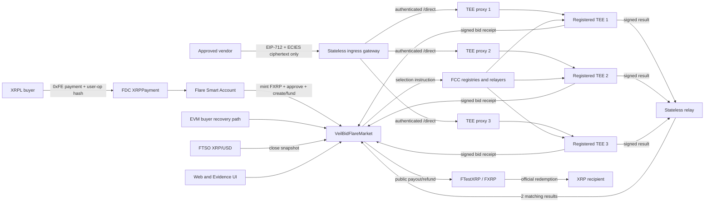
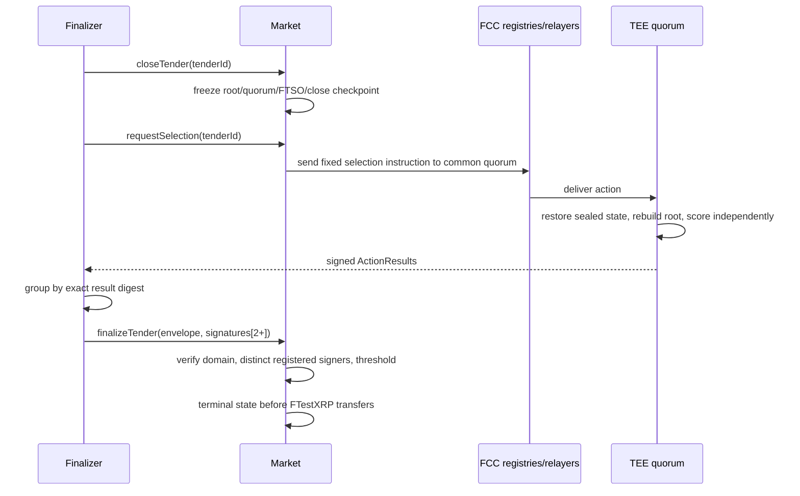

# VeilBid Flare Championship Architecture

> Status: Accepted architecture implemented by the verified Coston2 release;
> replacement-TEE recovery is the organizer-confirmed model and its rolling
> three-machine drill passes, while broader stateful drills and user validation remain open. Public role-workspace and accessibility hardening
> passes are recorded in Coston2 smoke evidence. Detailed rationale is in
> [`architecture-decisions.md`](architecture-decisions.md).

## 1. Goals

- Make private FCC computation and XRP interoperability essential to one product.
- Keep bid plaintext and ciphertext off permanent public ledgers.
- Remove single-client, buyer, relay, admin, and single-TEE winner authority.
- Make public tender, commitments, rules, quorum, result, and settlement fully
  reproducible from Flare state.
- Preserve recoverability across browser, relay, proxy, and one-machine outage.
- Use only deterministic, bounded, testable scoring.

## 2. System context



## 3. Canonical authorities

| State | Authority |
|---|---|
| Tender terms, vendors, rules, machine policy | Flare market contract |
| Accepted bid order and commitments | Flare market events/storage |
| Bid plaintext and credentials | Sealed state inside tender-fixed TEEs |
| FCC machine registration/code version | Official FCC contracts plus tender snapshot |
| FTSO price snapshot | Market-captured official feed value |
| Winner computation | Deterministic extension on each selected TEE |
| Result acceptance | Market threshold signature verification |
| Escrow and settlement | Market plus official FTestXRP/FXRP |
| XRPL authorization | XRPL signature, FDC proof, Smart Account nonce/hash checks |
| Public index | Rebuildable generated event index |

No application database or relay cache is canonical.

## 4. Private bid intake

### Tender machine policy

Before opening, a tender freezes:

- extension ID and approved code version;
- three registered TEE identities and public-key fingerprints;
- result threshold `2`;
- supported schema/scoring version;
- credential issuer/type policy.

One-of-one mode exists only in development feasibility.

### Vendor submission

The vendor:

1. verifies chain, market, tender, rules, extension, code version, and machine
   identities/keys;
2. encodes `BID_SCHEMA_V1` deterministically with a strong random salt;
3. ECIES-encrypts separately to each selected machine;
4. signs a short-lived EIP-712 authorization over each ciphertext hash and
   submits through the HTTPS ciphertext-only gateway; the gateway rereads the
   frozen manager/machine/key bindings and supplies the server-only `/direct`
   API key;
5. receives signed `BID_RECEIPT_V1` responses;
6. submits the receipt set to the market before deadline.

Each TEE decrypts and validates only inside confidential execution, then seals
the bid. Public receipts contain commitment/binding only.

The gateway can observe ciphertext and traffic metadata but has no decryption
key. It keeps no bid database, never logs or returns ciphertext, rejects
plaintext-shaped fields, and returns only the proxy action ID needed to poll a
TEE-signed receipt. Its three proxy URLs must exactly match the registered
machine URLs at the same Coston2 block used for key discovery/admission.

### Common quorum

For every accepted championship bid, the market validates one atomic receipt
set from all three frozen machines:

```text
bidReceiptBitmap = 0b111
commonQuorumBitmap = 0b111
```

Partial two-machine sets never enter contract state or the ordered root. This
guarantees that any surviving pair retains every accepted bid. Selection
dispatch filters the frozen set by current status/extension/code/key identity
and proceeds only with at least two valid machines; finalization revalidates the
same identity facts for both signers.

### Ordered root

The market assigns a one-indexed bid ID and updates the domain-separated rolling
root defined in ADR-008. This order defines the exact-tie rule and lets each TEE
detect missing or rolled-back sealed state.

## 5. Deterministic scoring

Bid schema supports:

- XRP or USD price at six-decimal fixed point;
- delivery days;
- warranty days;
- bounded buyer-approved credential issuer/type/signature tuples.

Public tender rules define hard bounds, required credential types, weights, and
`SCORING_V1`. Credentials gate eligibility; price/delivery/warranty produce a
checked weighted penalty. Lowest penalty wins; earlier accepted bid wins an
exact tie. There is no AI, natural-language scoring, or post-close buyer input.

## 6. FTSO close snapshot

If USD quotes are enabled, `closeTender` reads the official XRP/USD feed and
stores feed ID, value, decimals, timestamp, and close block. It rejects stale,
zero, unsupported, or malformed data. The exact snapshot is sent to every TEE
and signed in the result.

USD winner payout converts to XRP with the shared checked formula and rounds up.
XRP quotes pass through unchanged. Component penalties and losing conversions
remain private.

## 7. FCC selection and threshold result



The result binds schema, chain, market, extension, code, tender, rules, ordered
root, common quorum, FTSO snapshot, close block, winner slot/vendor/amount,
nonce, and expiry.

Split results remain pending and become public evidence of disagreement. A
relay never selects between them.

If the one-hour result envelope expires, a permissionless retry keeps every
closed-tender fact fixed but creates a new attempt nonce, expiry, and FCC
request ID. Results from prior attempts are invalid. If no attempt settles
within 24 hours of the first request, the buyer may record a failed-compute
refund; this is never represented as a selected winner or successful FCC run.

## 8. XRP-native funding

The flagship buyer uses Smart Account opcode `0xFE`:

1. derive deterministic PersonalAccount and nonce;
2. encode approval plus `createTender`/funding calls in a `PackedUserOperation`;
3. commit `keccak256(userOp)` in the XRPL payment memo;
4. deliver bytes to the executor;
5. the executor waits for three validated XRPL ledgers, requests the official
   FDC `XRPPayment` proof with itself as `proofOwner`, pays the live request
   fee, and waits for Relay finalization;
6. `executeDirectMintingWithData` verifies hash/sender/nonce, mints FTestXRP,
   and atomically executes the calls.

The executor does not accept arbitrary user-operation bytes. It rebuilds the
approval plus tender-creation batch from the canonical public job, checks the
gross payment can cover the current percentage/minimum minting fee plus the
requested escrow and memo executor fee, and binds every registry read to
Coston2. A successful transaction is still not a successful funding result
unless the AssetManager, MasterAccountController, and market emit the expected
mint, user-operation, and tender events. A rate-limited mint is reported as
`delayed` with a public-safe checkpoint. `flare:funding:resume` rechecks the
same payment, FDC request/round, quote, nonce, and user-operation commitment
before retrying the direct mint; no second XRPL payment is accepted and it
never becomes a sample or optimistic success state.

The PersonalAccount is the on-chain buyer. VeilBid has no XRPL key or custodial
signer. Direct EVM funding remains a recovery and developer path.

## 9. Settlement and redemption

The championship release accepts only official FTestXRP:

- award: public winning XRP amount to vendor, public remainder to buyer;
- no valid bid: full public refund;
- exact one-time conservation and non-transferable award receipt;
- no fee-on-transfer/rebasing token support;
- winner may use official FAssets redemption to native XRP.

Winning price and payout are public. Losing commercial data remains inside the
selected TEE boundary.

## 10. Recovery

- Browser/relay restart: rebuild public checkpoint from events.
- Proxy queue loss: after expiry, resend the fixed public FCC instruction with
  a fresh attempt nonce and request ID.
- One machine loss: remaining common quorum can compute and reach threshold.
- Machine/key/code change: cannot affect an open/closed tender.
- TEE sealed-state mismatch: machine refuses to sign; contract never lowers
  threshold.
- Split TEE result: remain pending; investigate/recompute exact input.
- Quorum loss: explicit liveness failure; after the fixed 24-hour grace the
  buyer may recover escrow with no award and no success claim.
- FTSO unavailable/stale: USD-enabled close pauses; no manual price.
- FDC/Smart Account failure: use the documented public-safe delayed-mint
  checkpoint/resume; no app custody and no duplicate XRPL payment.
- Competing finalizer: canonical reread and benign-race classification only.

## 11. Administration

Contracts are non-upgradeable. Governance may approve extension/code versions,
assets, feeds, and credential issuers for future tenders only. It cannot mutate
existing tender policy, decrypt bids, lower threshold, choose winner, withdraw
escrow, or bypass settlement verification.

## 12. Applications

- **Web:** wallet-free Public explorer; separate XRP Treasury, EVM Buyer,
  Vendor, Public Finalizer, and Auditor/Evidence workspaces; and the awarded
  vendor redemption journey. The Public Finalizer may directly simulate and
  submit permissionless close plus buyer-authorized cancel/refund calls, but it
  cannot decrypt bids, calculate a winner, dispatch FCC work, or group results.
  The Auditor performs one-checkpoint public reads only and has no signer.
- **Relay:** public close/request/result aggregation/finalize only.
- **Console:** isolated read-only Coston2 contract/FCC/FTSO inspection at one
  finalized checkpoint; FAssets redemption is exposed through the awarded
  vendor browser path and public FDC/FAssets facts remain read-only.
- **FCC extension:** private ingress, sealed state, deterministic scoring, and
  minimum signed result.

Every unavailable state is explicit. No application substitutes mock bids,
prices, proofs, results, or settlement.

## 13. Historical isolation

Sepolia/Nox contracts, bindings, evidence, and flows remain historical baseline.
They are not compilation, deployment, consumer, or evidence inputs for Flare.
