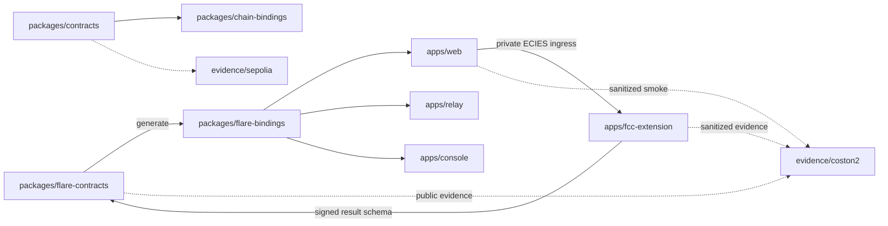

# VeilBid Flare Repository Layout

> Status: Current release layout. Historical workspaces remain isolated; new
> Flare workspaces and release-facing additions are gated by feasibility and
> verification evidence.

## 1. Target structure

```text
VeilBid/
├── apps/
│   ├── web/                 # shared UI, migrated to Coston2 judge path
│   ├── relay/               # stateless public lifecycle automation
│   ├── console/             # read-only public inspection
│   └── fcc-extension/       # new FCC TEE extension and proxy integration
├── packages/
│   ├── flare-contracts/     # new Flare contracts/tests/deployments
│   ├── flare-bindings/      # new generated Coston2/Flare bindings
│   ├── contracts/           # historical Sepolia/Nox baseline
│   └── chain-bindings/      # historical Sepolia/Nox bindings
├── evidence/
│   ├── coston2/             # new Summer Signal evidence
│   ├── sepolia/             # historical pre-hackathon evidence
│   ├── local/               # historical local baseline evidence
│   └── schemas/
├── tooling/scripts/
├── docs/
├── submission/flare/          # current Flare judge package; parent pack is historical
├── AGENTS.md
├── DESIGNS.md
├── PLAN.md                   # championship execution authority
├── README.md
└── SECURITY.md
```

`apps/fcc-extension`, `packages/flare-contracts`, `packages/flare-bindings`,
and `evidence/coston2` are implemented in the current Flare release. Future
paths or extensions must still wait for the corresponding feasibility gate;
historical Sepolia/Nox artifacts remain separate authorities.

## 2. Workspace responsibilities

### `apps/fcc-extension`

New official-scaffold-based confidential-compute workspace:

- canonical bid schema and command identifiers;
- authenticated private bid ingress and per-machine receipt signing;
- TEE-only decryption, sealed persistence, root reconstruction, and
  deterministic selection;
- three-machine execution and exact-digest threshold results;
- minimal signed result construction;
- structured allowlisted logs;
- proxy/indexer integration and health;
- extension unit, deterministic model, and Coston2 E2E tests.

It must not hold wallet custody, put plaintext/ciphertext on-chain, submit a
winner outside its deterministic rule, log request bodies, or persist plaintext
bid state beyond the documented confidential lifecycle.

### `packages/flare-contracts`

New authority for:

- `VeilBidFlareMarket` and award receipt;
- FCC registry/instruction/result interfaces;
- bid-receipt/common-quorum and ordered-root verification;
- FTestXRP, FTSO, FDC, FAssets, and Smart Account integration boundaries;
- unit, invariant, signature, adversarial, and Coston2 tests;
- Flare deployment manifests, source publication, and verification;
- artifact input for `packages/flare-bindings`.

It imports no artifact or address from the historical Nox deployment.

### `packages/flare-bindings`

Generated boundary for Coston2/Flare addresses, ABIs, event codecs, public
indexing, readiness, and domain types. Generated content comes only from
verified Flare production artifacts and manifests.

### `apps/web`

Reused product shell and UX patterns, migrated to:

- Coston2 wallet/network handling;
- FCC identity/key discovery, private encrypted ingress, and signed receipt
  submission;
- XRP-native Smart Account mint-and-fund and direct EVM recovery path;
- public FTSO snapshot, common quorum, threshold result, and FAssets settlement;
- Coston2 event-derived tender explorer;
- public result/signature/extension evidence;
- Flare asset funding and optional XRP-native journeys.

During transition, legacy Sepolia code remains identifiable and must not be
presented as the Flare judge path.

### `apps/relay`

Migrated stateless finalizer for close, FCC requests to the frozen common
quorum, public result retrieval, exact-digest grouping, and threshold finalize.
It contains no database, plaintext/ciphertext bid, TEE key, oracle override, or
winner logic.

### `apps/console`

Read-only public inspection with separate Sepolia and Coston2 MCP entry points.
The Flare tools inspect finalized tender state, extension/code/machine binding,
quorum/root, FTSO snapshot, selection/award facts, runtime code hash, immutable
dependencies, and threshold constants. They cannot decrypt bids, return raw FCC
responses, sign, or write transactions.

### Historical baseline workspaces

`packages/contracts` and `packages/chain-bindings` remain the exact Nox/Sepolia
implementation. They support regression and prove what existed before Summer
Signal. They are not inputs to Coston2 deployment or Flare bindings.

## 3. Dependency direction



Rules:

- Result schemas and operation identifiers have one canonical shared source or
  generated representation; Solidity and extension copies are drift-checked.
- Bid plaintext/ciphertext flows only from vendor memory to the authenticated
  TEE ingress. The market receives signed receipts and commitments only.
- Flare contracts do not depend on the extension runtime.
- Apps consume bindings through package exports, never relative source paths.
- Evidence is output and never runtime state.
- Historical and Flare deployment/binding graphs do not cross.

## 4. Canonical ownership

| Artifact | Target owner |
|---|---|
| Flare production Solidity | `packages/flare-contracts/src/` or chosen scaffold-equivalent |
| Flare contract tests | `packages/flare-contracts/test/` |
| Coston2 manifest | `packages/flare-contracts/deployments/coston2.release.json` |
| FCC extension business logic | `apps/fcc-extension/` |
| Canonical bid/receipt/result schemas | Flare shared schema source frozen during Gates B–D |
| Generated Flare bindings | `packages/flare-bindings/generated/` |
| Coston2 public index | `packages/flare-bindings/src/index/` |
| Browser-session bid plaintext | `apps/web` memory only |
| Finalizer runtime | `apps/relay/` |
| Public inspection tools | `apps/console/` |
| Coston2 evidence | `evidence/coston2/` |
| Historical Nox release | `packages/contracts`, `packages/chain-bindings`, `evidence/sepolia` |
| Product/security/deployment truth | root docs and `docs/` |
| Execution sequence and phase status | `PLAN.md` |
| Supplied competition/FCC source messages | `docs/original/` |
| Competition checklist/judging mapping | `docs/hackathon-brief.md` |
| Current Flare judge package | `submission/flare/` |
| Current FCC registration/proxy preflight | `docs/fcc-coston2-operations.md` |

## 5. Root orchestration

`pnpm-workspace.yaml` already discovers `apps/*` and `packages/*`, so new
workspaces can be added without changing discovery. Root `flare:*` scripts will
orchestrate only new Flare workspaces. Existing unprefixed scripts continue to
exercise the historical baseline until a deliberate migration commit changes
their authority.

## 6. Generated and secret material

Ignored outputs include build artifacts, caches, sealed extension runtime state,
proxy/Redis state, local environment files, tunnels, credentials, ephemeral
encrypted payloads, private diagnostics, and wallet/TEE/XRPL key material.

Committed extension configuration may contain only public registry addresses,
extension IDs, approved code/version hashes, TEE public identities/keys intended
for clients, and sanitized deployment identifiers.
